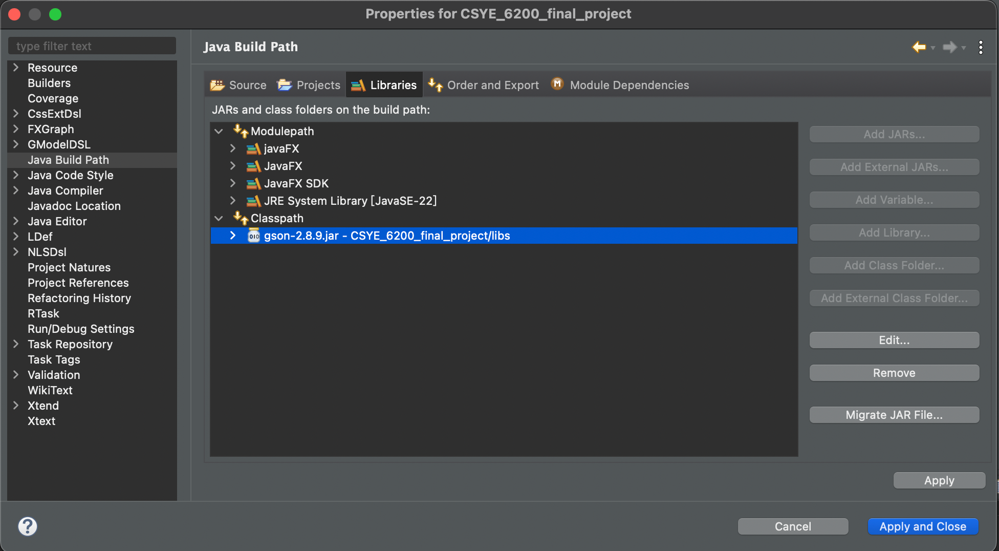
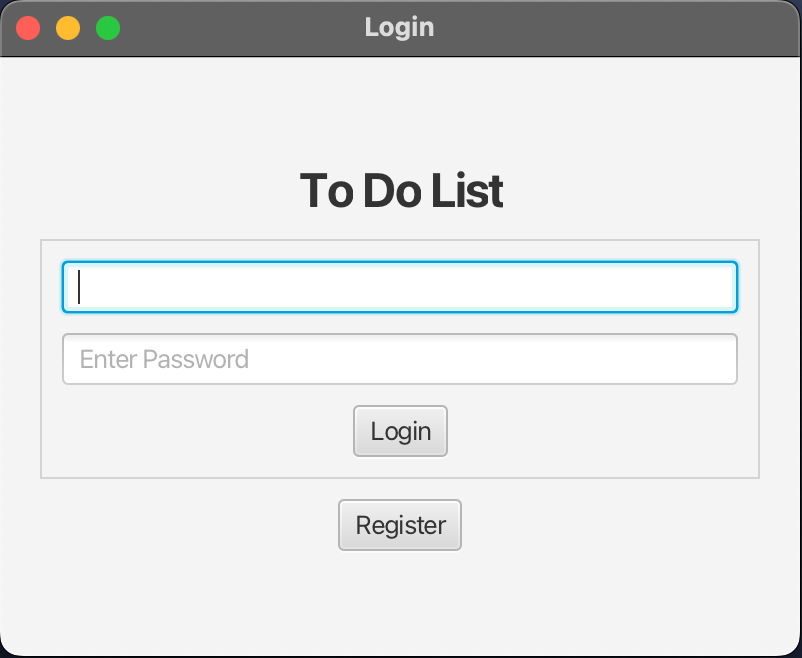
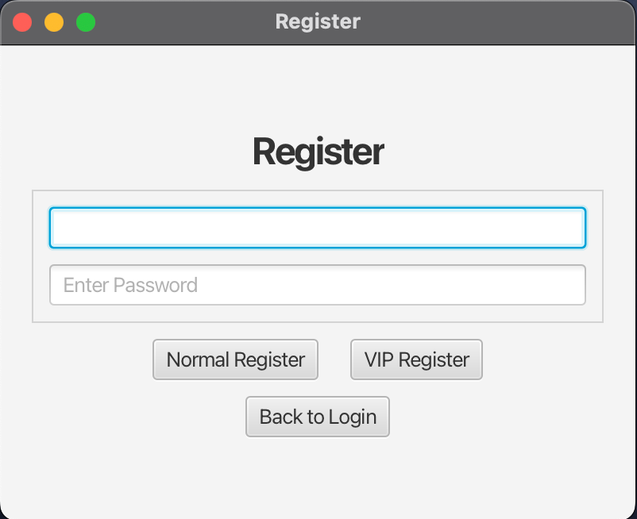
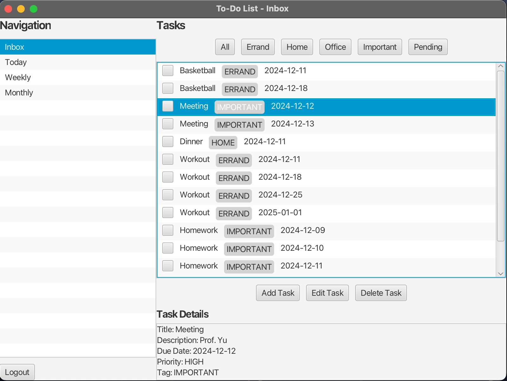
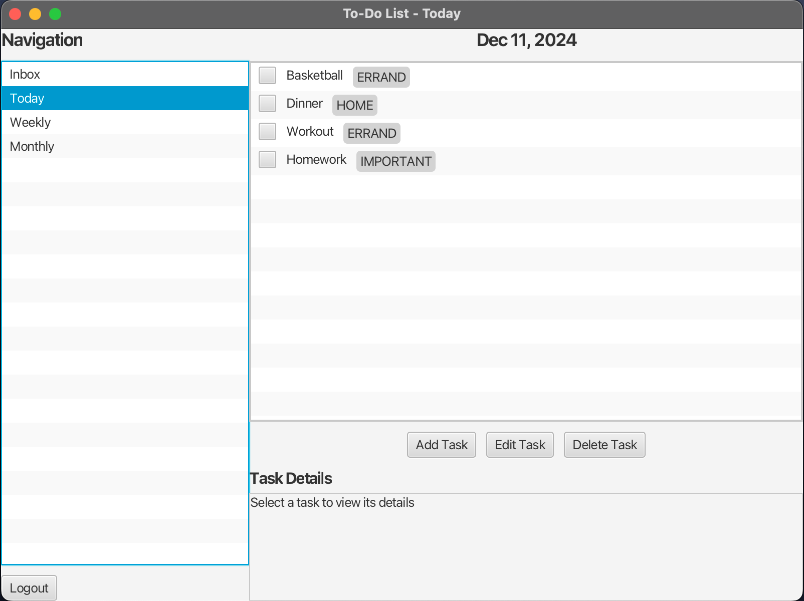
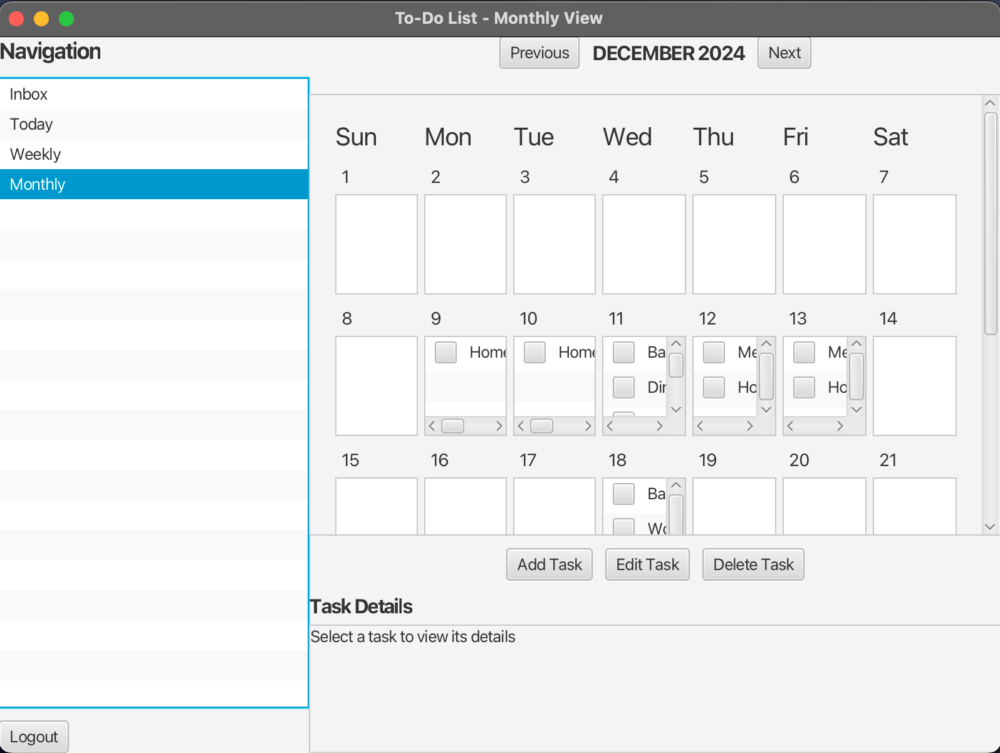
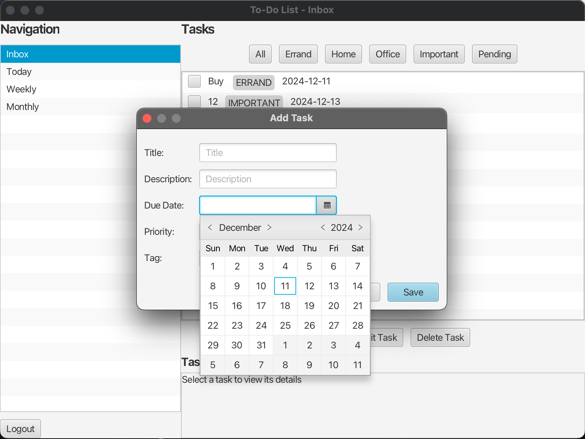
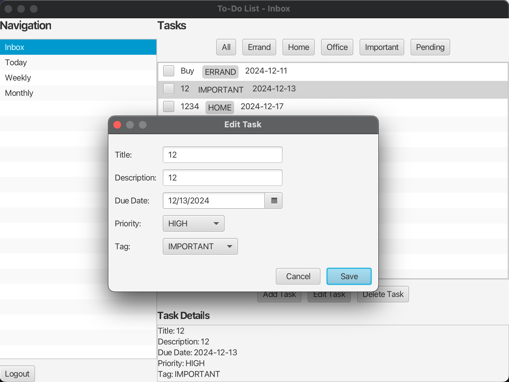
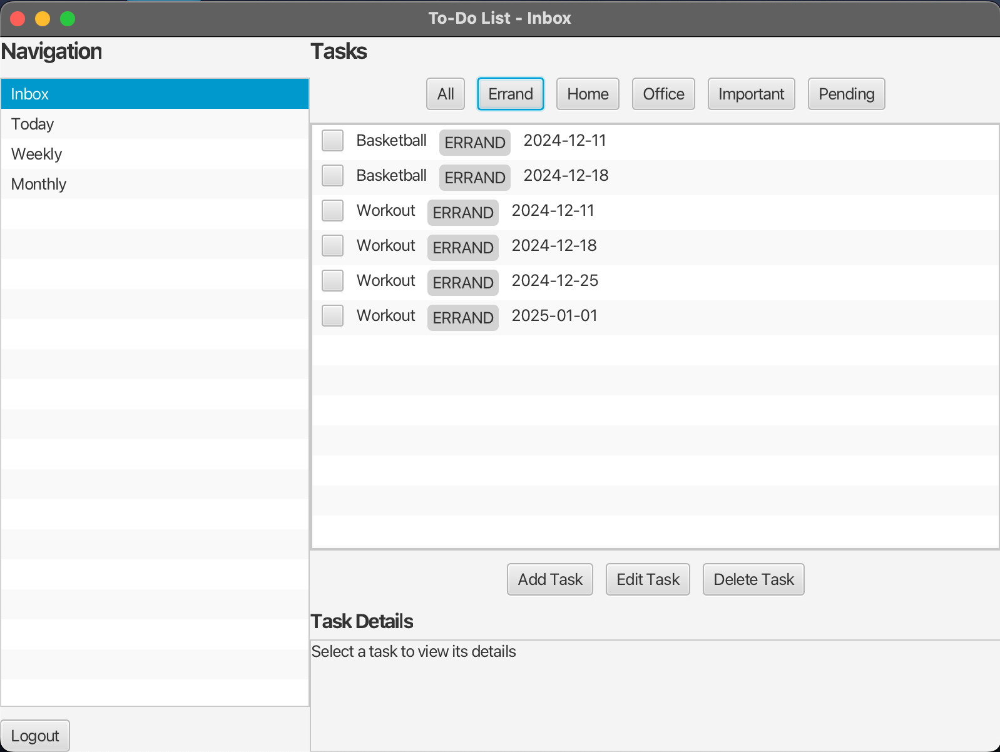

# Calendar Application


**Calendar Application** is a task management system developed as an academic project to demonstrate core concepts in object-oriented programming, and UI design with JavaFX.

## 🎯 Project Goals

This academic project was created to demonstrate:
- Object-oriented design principles in Java
- GUI development with JavaFX and SceneBuilder
- User authentication implementation
- Data persistence using JSON serialization
- Different view implementations of the same data

## 🌟 Features

- **User Authentication System**: Register and login functionality with multiple user types
- **Multi-layout Task Management**: View tasks in different time-based layouts
- **Real Calendar Integration**: Navigate between weeks and months with previous/next buttons
- **Task CRUD Operations**: Create, read, update, and delete task functionality
- **User Role System**: Different capabilities for normal users and VIP users
- **Data Persistence**: JSON-based storage using Google's Gson library

## 📥 Installation & Setup

### Prerequisites
- Java Development Kit (JDK) 11 or higher
- JavaFX SDK
- Gson library (included in the project)

### Setup Steps
1. Clone the repository:
   ```
   git clone https://github.com/chs415009/Calendar-Application.git
   ```
2. Ensure the Gson library is properly linked:
   - The gson-2.8.9.jar file is located in the "libs" folder
   - Verify the library is added to the project's classpath

   <p align="center">
     
   </p>

3. Build and run the project in your Java IDE

## 🚀 Application Workflow

### User Authentication
The application starts with a login screen. New users can register as either normal or VIP users.

<p align="center">
  
  
</p>

### Task Management Views
The application offers four different views to manage tasks:

<div align="center">
  <table>
    <tr>
      <td><b>Inbox View</b><br></td>
      <td><b>Today View</b><br></td>
    </tr>
    <tr>
      <td><b>Weekly View</b><br></td>
      <td><b>Monthly View</b><br></td>
    </tr>
  </table>
</div>

- **Inbox**: Displays all tasks associated with the account
- **Today**: Shows only tasks scheduled for the current day
- **Weekly**: Presents tasks organized by weekday for the current week
- **Monthly**: Displays a calendar view with tasks for the entire month

### Normal User Features
Normal users can perform basic task management operations:

<p align="center">
  
  
  
</p>

- **Add Tasks**: Create individual tasks with date, description, and tags
- **Edit Tasks**: Modify details of existing tasks
- **Delete Tasks**: Remove selected tasks from the account
- **Filter Tasks**: In the inbox view, filter tasks by tags

### VIP User Features
VIP users have access to advanced functionality:

<p align="center">
  
  
</p>

- **Recurring Tasks**: Create tasks that repeat at specified intervals (weekly, monthly, etc.)
- **Batch Deletion**: Option to delete all recurring instances of a task
- **All Normal User Features**: Access to all functionality available to normal users

## 🔧 Technical Implementation

### Object-Oriented Design
- **User Class Hierarchy**: Implementation of user types with inheritance
- **Task Model**: Encapsulated task data with proper access modifiers
- **Controller Pattern**: Separation of UI logic from data management

### JavaFX and SceneBuilder
- **FXML-based UI**: Declarative UI design using SceneBuilder
- **Event Handling**: Implementation of user interaction through event listeners
- **Scene Navigation**: Management of different screens and views

### Data Persistence
- **JSON Serialization**: Using Gson to convert Java objects to/from JSON
- **File I/O**: Reading and writing data to persistent storage
- **Automatic Saving**: Changes are saved when the application closes

## 🎓 Learning Outcomes

This project demonstrates proficiency in:

- **OOP Concepts**: Inheritance, encapsulation, polymorphism
- **Design Patterns**: MVC architecture, singleton for data management
- **UI Development**: Creating responsive and intuitive user interfaces
- **Date Management**: Working with calendar data and date calculations
- **File Handling**: Implementing persistence through file operations

## 📚 Academic Context

This project was developed as part of a Java Object-Oriented Design course, with emphasis on:
- Implementing proper OOP principles
- Creating GUIs with JavaFX and SceneBuilder
- Managing application state and persistence
- Handling user authentication and authorization

---

**Calendar Application** - An academic project showcasing Java OOP principles, JavaFX, and UI design.
