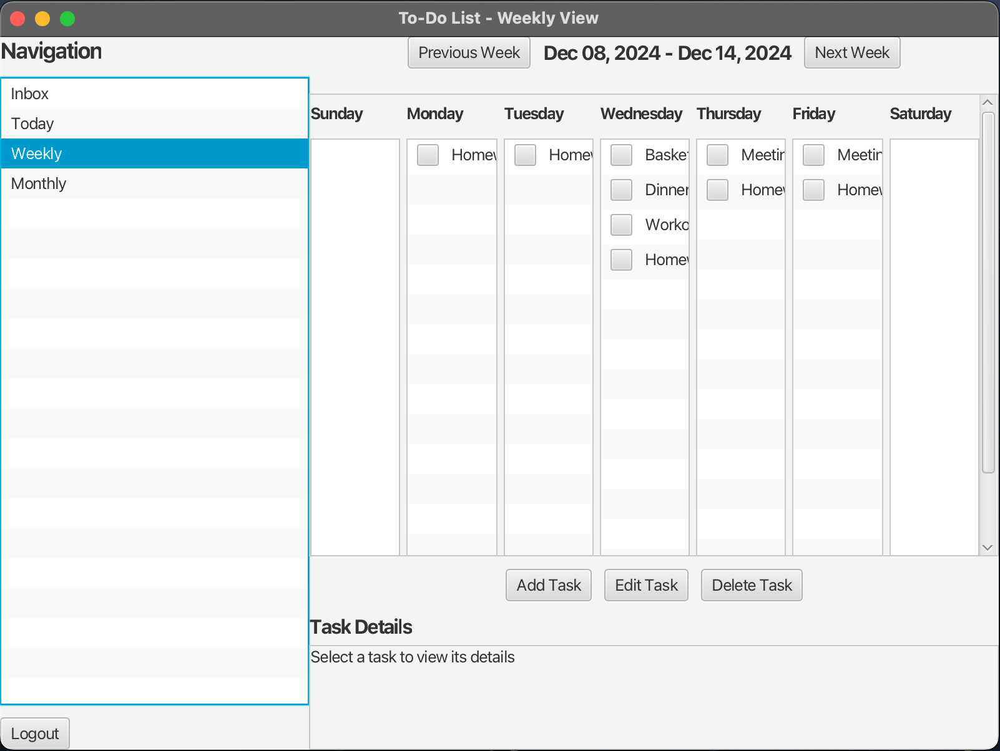

# Calendar-Application
Description: An application that help users to manage their to-do list with a calendar in different layout.

## Download:
1. Click below and download the zip file. 
https://github.com/chs415009/Calendar-Application.git  

2. Add the gson file to the libraries of the project. 
   The gson file is already in the package. Just make sure the path is correct.  
   

## Instructions:
### 1. __Sign in & Sign up__  

* If you are a new user, go to the register page first. We design two kinds of users: normal and VIP.
* Register the VIP user will have some advanced features. 

  

### 2. __Introduction to Layout__  

* These are the different layout for the application: 
   *  __Inbox__: All the tasks of this account. 
   *  __Today__: Showing tasks for today. 
   *  __Weekly__: Showing tasks for this week. 
   *  __Monthly__: Showing tasks for this month. 
* The application has implemented real calendar, so we can see different weeks or months through the "previos" and "next" buttons.

  

### 3. __Features of Normal Users__  

* These two images shows the "add", "edit", "delete" and "filter" feature.
   * Normal user can only create one task at a time. No empty input is allowed.
   * Edit button is only allowed after selecting one the task. And once you select the task, the detail will show at the bottom of the page.
   * As to the "delete" button, once clicked, the selected task will be deleted from this account.
   * Filter can only be accessed in the inbox page, it helps the user to go though tasks catogorized by tags.

  

### 4. __Features of VIP Users__  

* VIP users have all the features that normal users have and two advanced feature.
   * When adding tasks, VIP user can add recurring tasks through input the frequency and quantity.  
   For example, "frequency: weekly + quantity: 3" means repeat this task 3 times every week since the selected date.
   * When deleting tasks, the user can decide to delete only this task, or all the other tasks that have the same name and tag.
 
  

### 5. __Logout & Save__  
* When the user clicks the **Logout** button at the bottom-left corner of the page, the system automatically navigates back to the login page.  
* All changes made by users during the session are saved when the page is closed.  
* Data is stored in a **JSON** file, which the system reads when the project is launched again.  
